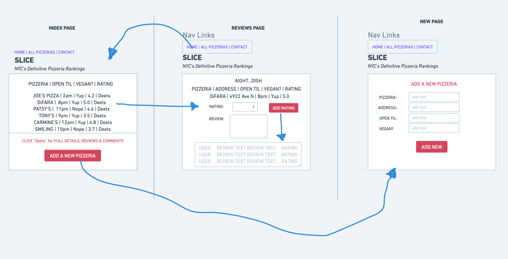
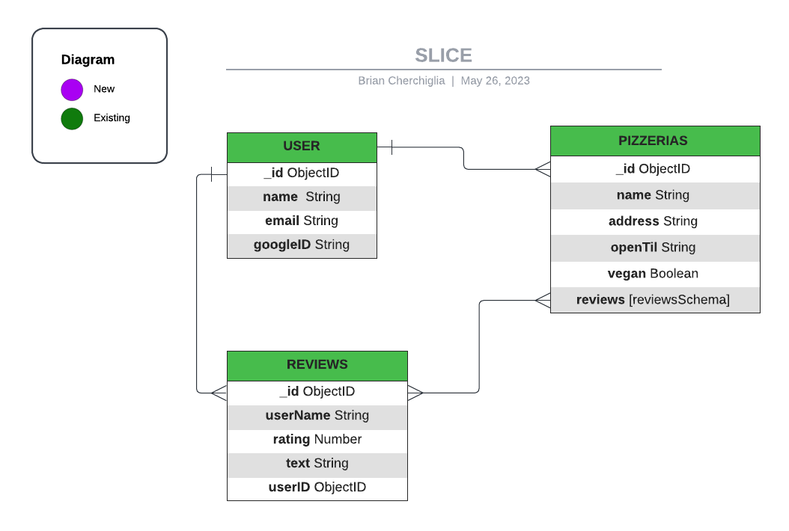

# **SLICE**
####
_NYC's very own definitive Pizza Power Rankings_

#### Written by Brian Cherchiglia
#### Published by Cherch
##### Created on 05/25/2024
***
***
#### [**GitHub Repo**](https://github.com/cherch173/u2_project_prompt)
#### [**Trello Board**](https://trello.com/invite/b/v3VAizMi/ATTI545a35c236d2a7c8f922f1c022bd94b30A3995FF/software-development-web-app-ios-app-android-app)
***
***
## _**Description**_
This is the _official_ end to the argument.

**Slice** is designed to allow New York to speak for itself, amongst itself about what it _allegedly_ knows best: Pizza.

**Slice** allows users to review NYC's Pizzerias (and possibly submit images) using a 1-5 Slice Rating system (5 Slices saved for the most elite of all joints).

***
### _**CONCEPT**_

Using Express, most of this can already be accomplished using a simple **Models, Views, Controllers** setup.

Using best practice routing we'll interchange data sets between USERS, PIZZERIAS and their REVIEWS using request based Routing (**GET, PUSH, POST & DELETE**).

The local database will be stored in **MongoDB** and we'll be using **Mongoose** & **Axios** to get pre-existing Restaurant Data from an **API** in lieu of using an internal data set. This will be especially helpful for accessing a Pizzeria's address, i.e. Google Maps.

User Authentication will be achieved using **Google OAuth**.
***

### _**Technologies**_
- ExpressJS
- MongoDB / Mongoose
- Axios (version 2.0)
- OAuth through Google
***
## _**Getting Started**_

The home page (INDEX) will be very important for simplistic design.

Using EJS Partials I'll embed links at the top of the each page to create a uniform & familiar layout as we navigate between our three branch directories:

- All Pizzerias (Index)
- Pizzeria Details (Reviews)
- New Pizzeria (New)

Much like our mongoose-movies exercise, I plan to implement a user-based rating (**reviews**) system where we use a 1-5 scale to determine which pizzeria _is_ in fact the best in NYC. The numeric rating will be required: true, while text comments won't be required.

Through the **pizzeriaSchema**, USERS will be able to contribute to a small array of data that will be visible when they SELECT a Pizzeria:
- name: String
- Borough: String
- address: String
- openTil : Time
- vegan / gluten-free: Boolean
- reviews: [reviewsSchema]

The **reviewSchema** will be simplistic, carrying only the following crtieria:
- rating: Number
- review: Content (Text)
- totalRating: Number

We'll use **SHOW Functionality** to bring active and recently added pizzerias to the home page (INDEX).

For **Authentication and Authorization** purposes we'll be using OAuth to avoid having to store internal user data.  It will also allow us to hide certain features (i.e. the ability to rate a pizzeria) unless the user is logged in.

***
***
## **_WIREFRAME_**

***

## **_ERD_**

***
***
## **_PROJECT FLOW_**

- **Weekend**
    - [X] Build Express Framework
    - [X] Install node packages
    - [X] Install dotenv & create gitIgnore to ensure safety
    - [X] Begin EJS Partials and Index Views
    - [X] Install Mongoose 
    - [X]  Enter DATABASE URL to .env
    - [X] Create Models, Views & Controller Directories for Pizzerias
    - [X] Begin Pizzerias Routing
    - [X] Create first Database entries with Node & MongoDB 
- **Monday** (_up to here was completed Saturday 05/27/2023_): 
    - [X] Models (Pizzeria): Generate Schemas and Database
    - [X] New (MVC)
    - [X] Prove MongoDB is accepting new Data via Models by checking Atlas itself
    - [X] Render NEW Pizzerias to INDEX (All Pizzerias)
    - [X] Show Functionality
    - [X] Add Details feature that pulls individual Pizzeria by Object ID (Get/:id)
    - [X] Reviews (MVC)
    - [X] Succesfully test adding Reviews
    - [X] Verify in MongoDB that reviewSchema is actually being sent to pizzeriaSchema and is logging values as Objects inside an Array
- **Tuesday**: 
    - [X] Authentication/ Authorizaation OAuth
    - [X] Create Google API Credentials
    - [X] Install Express Session Middleware
    - [X] Install Passport
    - [X] Delete Reviews Functionality
    - [X] ratingsTotal composed (_up to **here** was completed Sunday May 28th, 2023_)
    - [X] ratingsTotal displaying correctly
    - [X] Aesthetics (CSS & Bootstrap)
- **Wednesday**: 
    - [X] Make Index Table Sort-By
    - [X] Ensure Mobile Optimization and test media queries
    - [X] Clean out redundancies and/or duplicate commmands 
    - [X] Debugging & sussin out errors/typos
    - [] Get Index Table to sort by Highest Ranking as default
- **Thursday**:
    - [] Adjust Open Til Time to 12H format and include am/pm
    - [] BRANCH
    - [] Try to implement Google Maps API to site from new branch to try to get subway data
    - [X] Final Testing Phase
    - [X] Deploy
***
***

***
***
### _**Credits**_
##### Ren & Stimpy Gif: [Tenor](https://media.tenor.com/X2xUUHbZrXMAAAAC/pizza-party.gif)
##### Spongebob Krusty Krab Pizza Gif: [Tenor](https://media.tenor.com/-lohISybXxoAAAAC/spongebob-the-krusty-krab-pizza.gif)
##### Homer Simpson Gif: [Gifer](ttps://i.gifer.com/IPR.gif)
##### Michaelangelo Gif: [Tenor](https://media.tenor.com/6omVw7_jl7AAAAAC/tmnt-michelangelo.gif)
##### Shaq Gif [LinkedIN](https://media.licdn.com/dms/image/C5622AQFmF4tfuXMNpw/feedshare-shrink_2048_1536/0/1666103725012?e=1687996800&v=beta&t=GuwawuRSuWxO6JFoyL2RXpcr-ngcKdAICIOKVMUNj80)